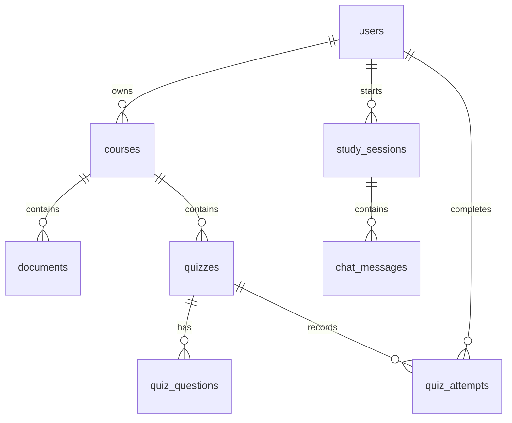

# StudyMate Database Schema

## ERD MVP

## Bang du lieu

| Bang | Muc dich | Quan he chinh |
| --- | --- | --- |
| `users` | Tai khoan nguoi dung | So huu course, study session va quiz attempt |
| `courses` | Mon hoc cua mot nguoi dung | Thuoc `users` qua `owner_id` |
| `documents` | Metadata tai lieu | Thuoc `courses` qua `course_id` |
| `study_sessions` | Phien hoc theo mon hoc | Thuoc `users`, co the gan `course_id` |
| `chat_messages` | Lich su hoi dap | Thuoc `study_sessions` |
| `quizzes` | Bo cau hoi on tap | Thuoc `courses` |
| `quiz_questions` | Cau hoi trong quiz | Thuoc `quizzes` |
| `quiz_attempts` | Ket qua lam quiz | Thuoc `users` va `quizzes` |

## Quy tac du lieu

- Email trong `users` la duy nhat, duoc luu chu thuong de dam bao unique khong phu thuoc hoa thuong.
- `courses.owner_id` la bat buoc. Service Course chi truy van theo ca `course_id` va `owner_id`.
- Xoa course se xoa cac document va quiz lien quan; khong xoa lich su chat/quiz attempt de tranh mat du lieu hoc tap. Cac ban ghi nay se dat `course_id` thanh `NULL` neu can.
- Thoi gian su dung `TIMESTAMP WITH TIME ZONE` va duoc tao o backend/database.
- Noi dung file va vector embedding khong luu trong cac bang MVP nay; chi luu duong dan file va trang thai xu ly.

## Trang thai du kien

- Document: `UPLOADED`, `PROCESSING`, `READY`, `FAILED`.
- Study session: `ACTIVE`, `ARCHIVED`.
- Quiz attempt: `IN_PROGRESS`, `SUBMITTED`.
