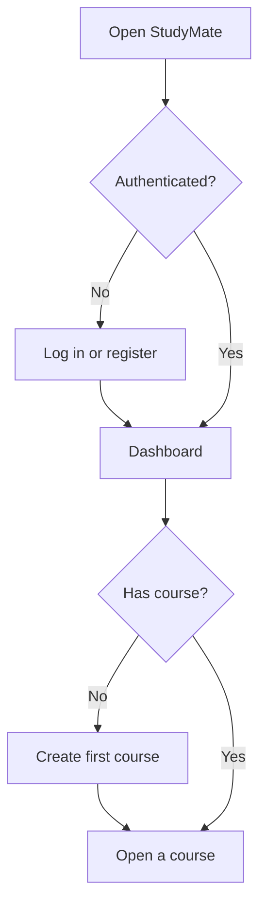
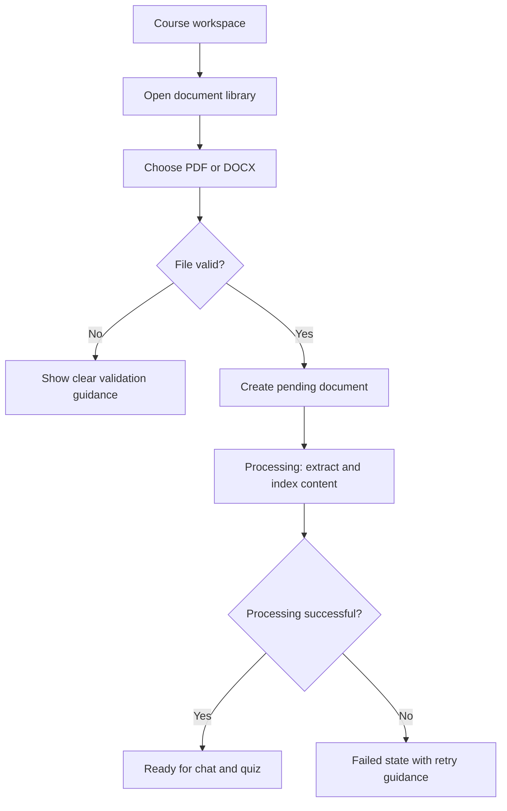
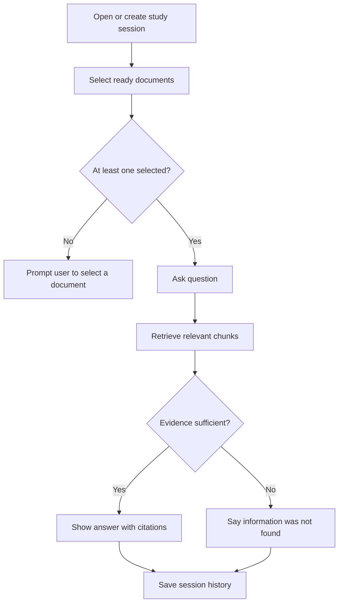
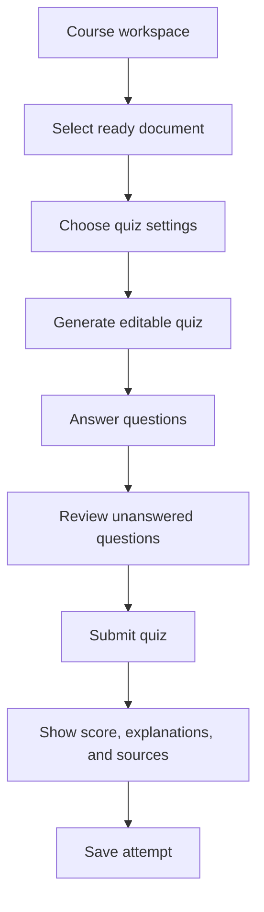

# StudyMate User Flows

## Figma handoff

No Figma account or file is available in this session, so this repository contains the source specification rather than a claimed Figma artefact. Import these flows into a Figma page named `StudyMate Chapter 4`, create one section per flow, then record the file and prototype URLs in `docs/design/FIGMA_LINKS.md`.

## 1. Start a study workspace

## 2. Upload and process a document

## 3. Ask a grounded question

## 4. Generate and complete a quiz

## Flow acceptance checks

- Every flow offers a useful next action after an empty, loading, or failure state.
- Document answers and quiz feedback retain a path back to the course source.
- A student can return to Dashboard or the course workspace without losing context.
